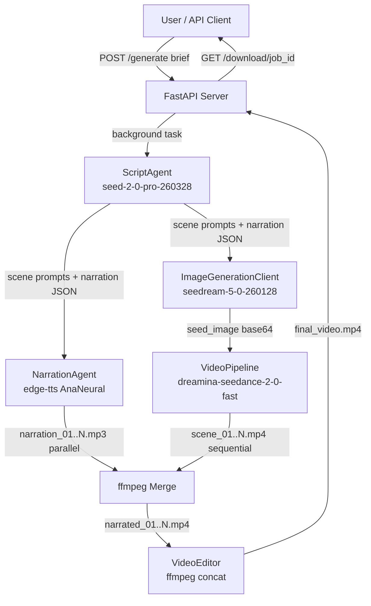
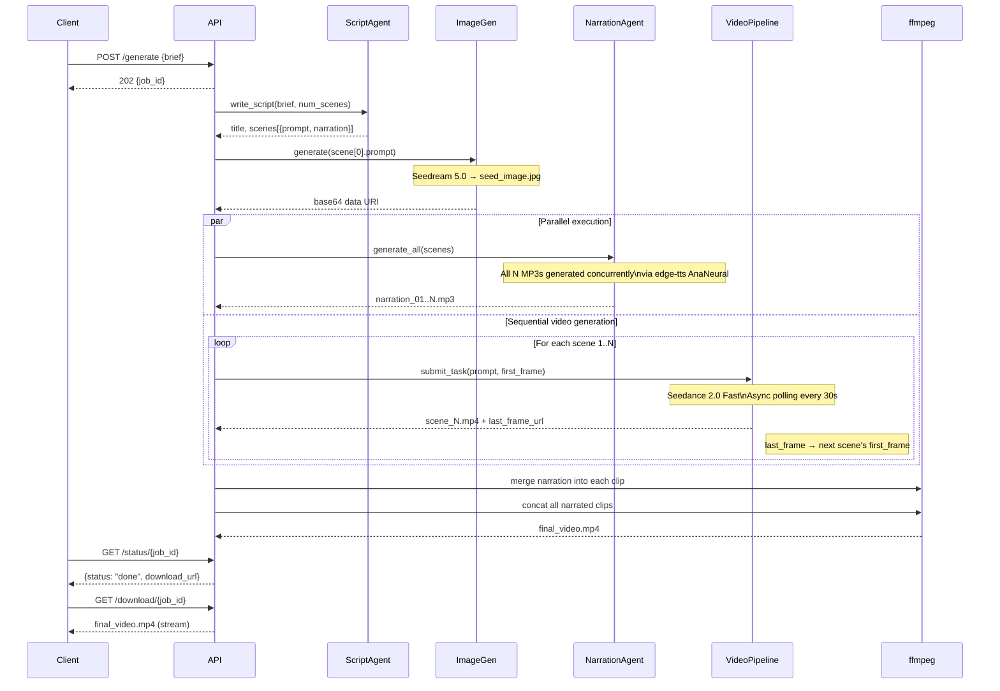
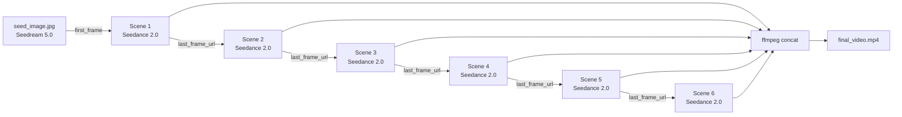

# Seedance Teaching Video Pipeline

An end-to-end AI pipeline that generates narrated educational videos for kids from a single text brief. Powered by **BytePlus ModelArk** (Seedance 2.0, Seedream 5.0, Seed-2.0) and served via a **FastAPI** async REST API.

---

## Demo

> *"A fun cartoon teacher explaining the solar system to kids"*

One API call → 30-second narrated cartoon teaching video, fully generated by AI.

Sample output: [`samples/final_video.mp4`](samples/final_video.mp4)

---

## Architecture Overview

The system is composed of four AI agents and three media processing steps, all orchestrated asynchronously.



---

## Pipeline Flow



---

## Scene Chaining

The key to visual continuity across scenes is the `return_last_frame` mechanism:



Each scene's last frame becomes the first frame of the next scene, ensuring smooth visual transitions without jarring cuts.

---

## Module Structure

```
.
├── api/
│   └── main.py                  # FastAPI server — endpoints, job management
│
├── seedance_pipeline/
│   ├── __init__.py              # Public exports
│   ├── models.py                # Scene, PipelineConfig dataclasses
│   ├── env.py                   # .env loader, API key helper
│   ├── script_agent.py          # ScriptAgent — writes prompts + narration
│   ├── image_client.py          # ImageGenerationClient — seed image via Seedream 5.0
│   ├── client.py                # VideoGenerationClient — async Seedance 2.0 wrapper
│   ├── narration_agent.py       # NarrationAgent — parallel TTS via edge-tts
│   ├── downloader.py            # Downloader — HTTP file download
│   ├── editor.py                # VideoEditor — ffmpeg concat
│   └── pipeline.py              # VideoPipeline — async orchestrator
│
├── tests/
│   └── test_script_agent.py     # Integration tests for ScriptAgent
│
├── scripts/
│   └── init_dev_env/
│       ├── setup_mac.sh         # macOS/Linux environment setup
│       └── setup_windows.bat    # Windows environment setup
│
├── python/
│   └── demo_standard.py         # Standalone SDK demo (video editing example)
│
├── samples/
│   └── final_video.mp4          # Sample generated output
│
├── run_pipeline.py              # CLI entry point
├── .env                         # ARK_API_KEY (not committed)
└── README.md
```

---

## AI Models Used

| Agent | Model | Provider | Purpose |
|---|---|---|---|
| ScriptAgent | `seed-2-0-pro-260328` | BytePlus ModelArk | Writes cinematic scene prompts + narration from brief |
| ImageGenerationClient | `seedream-5-0-260128` | BytePlus ModelArk | Generates seed image for scene 1 |
| VideoGenerationClient | `dreamina-seedance-2-0-fast-260128` | BytePlus ModelArk | Generates each video scene |
| NarrationAgent | `en-US-AnaNeural` | Microsoft edge-tts | Converts narration text to MP3 (kids cartoon voice) |

---

## Output Structure

Each pipeline run creates a timestamped folder:

```
output/
└── run_20260418_144020/
    ├── seed_image.jpg          ← AI-generated opening frame (Seedream 5.0)
    ├── scene_01.mp4            ← Raw video clips (Seedance 2.0)
    ├── scene_02.mp4
    ├── ...
    ├── narration_01.mp3        ← TTS narration tracks (edge-tts)
    ├── narration_02.mp3
    ├── ...
    ├── narrated_01.mp4         ← Clips with narration merged in
    ├── narrated_02.mp4
    ├── ...
    ├── final_video.mp4         ← Final concatenated video
    └── result.json             ← Frontend-ready metadata
```

### `result.json` schema

```json
[{
  "output": "output/run_20260418_144020/final_video.mp4",
  "run_id": "run_20260418_144020",
  "total_scenes": 6,
  "scene_duration": 5,
  "ratio": "16:9",
  "audio": true,
  "scenes": [
    {
      "scene": 1,
      "prompt": "Cinematic scene prompt...",
      "narration": "Spoken narration text...",
      "clip": "output/run_20260418_144020/scene_01.mp4",
      "narration_audio": "output/run_20260418_144020/narration_01.mp3"
    }
  ]
}]
```

---

## Setup

### Prerequisites

- Python 3.12
- ffmpeg (`brew install ffmpeg` on macOS)
- BytePlus ModelArk API key — [get one here](https://console.byteplus.com/ark/region:ark+ap-southeast-1/apiKey)

### Install

```bash
bash scripts/init_dev_env/setup_mac.sh
```

This creates `.venv` with all dependencies. Then add your API key:

```bash
echo 'ARK_API_KEY=your-key-here' > .env
```

### Dependencies

```
byteplussdkarkruntime   # BytePlus ModelArk SDK
fastapi                 # REST API framework
uvicorn                 # ASGI server
edge-tts                # Microsoft Neural TTS (free, no API key)
httpx                   # Async HTTP client
requests                # Sync HTTP (downloader)
pytest                  # Testing
```

---

## Usage

### CLI

Edit `USER_BRIEF` in `run_pipeline.py`, then:

```bash
.venv/bin/python run_pipeline.py
```

### API Server

```bash
.venv/bin/uvicorn api.main:app --reload --port 8000
```

Interactive docs: **http://localhost:8000/docs**

#### Generate a video

```bash
# 1. Submit job
curl -X POST http://localhost:8000/generate \
  -H "Content-Type: application/json" \
  -d '{
    "brief": "A cartoon teacher explaining the water cycle to kids",
    "num_scenes": 6,
    "scene_duration": 5,
    "ratio": "16:9"
  }'
# → {"job_id": "abc-123", "status": "pending", "message": "..."}

# 2. Poll status (~10–15 min)
curl http://localhost:8000/status/abc-123
# → {"status": "done", "download_url": "/download/abc-123"}

# 3. Download
curl http://localhost:8000/download/abc-123 -o teaching_video.mp4
```

#### API Endpoints

| Method | Path | Description |
|---|---|---|
| `POST` | `/generate` | Submit a video generation job |
| `GET` | `/status/{job_id}` | Poll job status |
| `GET` | `/download/{job_id}` | Stream `final_video.mp4` |
| `GET` | `/health` | Health check |

---

## Configuration

`PipelineConfig` controls all pipeline parameters:

```python
PipelineConfig(
    model_id="dreamina-seedance-2-0-fast-260128",  # or -260128 for full quality
    scene_duration=5,      # seconds per scene (4–15)
    ratio="16:9",          # 16:9 | 9:16 | 1:1 | 4:3
    generate_audio=True,   # AI-synced audio per clip
    watermark=False,
    poll_interval=30,      # seconds between status checks
    output_dir="output",
    output_filename="final_video.mp4",
)
```

---

## Testing

```bash
.venv/bin/python -m pytest tests/test_script_agent.py -v -s
```

Tests call the real BytePlus API — requires `ARK_API_KEY` in `.env`. The API is called once in `setUpClass` and all assertions share the result.

---

## Async Performance

The pipeline is optimised to minimise wall-clock time:

```
t=0s    ScriptAgent writes script (sync, ~20s)
t=20s   ImageGen generates seed image  ─────────────────────┐ parallel
t=20s   NarrationAgent generates all N MP3s (async, ~5s)  ──┘
t=25s   Scene 1 submitted → polling (~90s)
t=115s  Scene 2 submitted → polling (~90s)
...
t=N*90s All clips downloaded
        Narration merge (instant, already done)
        ffmpeg concat (~1s)
```

Narration generation (all scenes in parallel) completes in ~5 seconds while scene 1 is still being generated, adding zero extra time to the total.

---

## Limitations & Notes

- Seedance 2.0 does not allow real human faces in reference images
- Audio content filter may trigger on some prompts — the pipeline auto-retries without audio and uses TTS narration instead
- Video generation takes ~90s per scene on the fast model (~10 min for 6 scenes)
- Job state is in-memory — restart the server and jobs are lost (use Redis/DB for production)
- Generated video URLs from BytePlus expire after 24 hours — clips are downloaded immediately

---

## License

MIT
